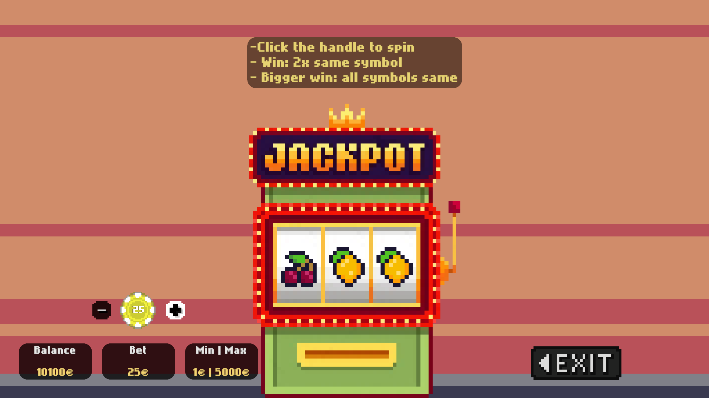

# **BetterLife**

**BetterLife** is a story game about a man struggling with gambling addiction.  
In order to cure himself, he must earn enough money to afford rehab — but the only way to do so is to hit big by gambling one final time.

The gameplay loop focuses on balancing risk and reward with loans and gambling. Save enough money to afford rehab before debt catches up.

**Lose control of your loans — and it’s game over.**

## 📸 Screenshots

**Roulette**

**Blackjack**

**Slots**

**Player Home**

**Take Loan**

**Main Menu**

## 🎮 Features

- **Small open world** — freely explore key locations including your home, the casino, and the loan shark’s office.
- **Dialogue system** — Have fun interacting with a variety of objects and NPCs
- **Loan system** — borrow money to stay in the game, but remember: debts don’t forgive easily.
- **Game timer** — manage your time and repayments before it’s too late.
- **Multiple endings** — two outcomes with three possible paths:
  - **Win:** earn enough for rehab and see the good ending.
  - **Lose:** fail to repay your loan or choose to give up and see the bad ending
- **Three fully implemented casino games:**

  1. **Slots** – simple slot machine gameplay.
  2. **Blackjack** – complete implementation with insurance, double down, and split mechanics.
  3. **Roulette** – full betting table with all standard bets, featuring a custom physics-based wheel simulation.
  
  All casino games can also be played freely with unlimited money outside the story mode.

## 🧩 Technical Highlights

- **Service Locator System** – a lightweight global service layer supporting interface-based lookups, ensuring modularity and testability across systems like audio, UI, and timers.  
- **Reusable Casino Framework** – a generic, event-driven `CasinoMoneyHandler<TBet, TResult, TResolvedResult>` abstraction that unifies bet handling, payouts, and UI updates across Slots, Blackjack, and Roulette.  
- **Dialogue System** – a custom ScriptableObject-driven system supporting chained conversations, yes/no branching, and flexible triggers for story events.  
- **Modular UI Architecture** – attachable HUD panels and reusable `HideableElement` components for consistent, animated show/hide logic with minimal boilerplate.  
- **Clean Scene Management** – a simple fade-based scene loader that supports seamless transitions between world locations and integrates smoothly with cutscenes.  
- **Classic Interactable System** – a consistent `IInteractable` interface pattern that handles all world interactions uniformly.

## 🛠️ Development Story & Lessons Learned

*BetterLife* originally began as a group project in the summer of 2024, back when I had just learned the basics of Unity and programming in general.  
The early version was ambitious but messy — a mix of copy-pasted code, AI-generated snippets, and overcomplicated systems riddled with hacks and bad practices.  

A year later, I decided to revisit the project with the goal of rebuilding it into something maintainable and worth sharing.  
I assumed it would be easy enough, since the game was “almost finished”, but getting it into an acceptable state ended up requiring a complete refactor from the ground up.

Beyond finishing the game, the refactor became an experiment in different coding styles, abstractions, and design patterns in Unity and C#.  
Some systems turned out elegant, others less so, but each was a valuable learning experience that helped me grow as a programmer and gain transferable skills for any domain.

**Key takeaways:**
- Relying on AI-generated or copied code without understanding it leads to long-term pain.  
- Refactoring messy, overambitious code is much harder than writing clean systems from the start.  
- Becoming a better programmer overall — even outside Unity — naturally translates into writing cleaner, more maintainable game code.

## ▶️ How to Play / Run

You can play *BetterLife* by downloading the `.exe` file [here](https://github.com/simoalanne/BetterLife/releases)

Alternatively, you can clone the repo and open the project in Unity:
- Open the project from Unity Hub and install a compatible version if required.
- Start the game from `MainMenu` or any scene you like

## 🛠️ Tech Stack

- Unity 6.2
- C# 9